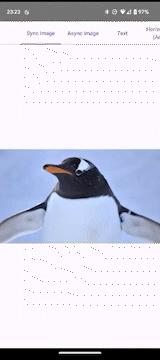

# Zoomable

Zoomable is an android library working with Jetpack Compose.
It enables the content zoomable by pinch gesture, by double-tap, or by double-tap and drag gesture.

|  |  |  |
|----------------------|-------------------------|------------------------------------|
| Pinch                | Double-tap              | Double-tap and drag                |


Zoomable provides a simple Modifier extension function `Modifier.zoomable`.

Here is the simplest sample code.
You can make image zoomable by just adding one line code.

```Kotlin
Image(
    painter = painterResource(id = R.drawable.penguin),
    contentDescription = null,
    modifier = Modifier.zoomable(rememberZoomState()),
)
```

Zoomable can be used with

- any composable components such as `Image`, `Text`, etc.
- asynchronous image composable such as coil's `AsyncImage`.

Zoomable also can be used in conjunction with

- Accompanist's `HorizontalPager` and `VerticalPager`.
- Androidx's `HorizontalPager` and `VerticalPager` introduced in Compose v1.4.0.

## Usage

### Download

Zoomable is available on Maven Central.

```
repositories {
    mavenCentral()
}

dependencies {
    implementation "net.engawapg.lib:zoomable:$version"
}
```

The latest version: 

### Basic Usage

You can use `Modifier.zoomable` to make contents such as an image zoomable.
The zoom state is managed in a `ZoomState` object that can be created via `rememberZoomState`.
If `contentSize` is set, the range of offset will be optimized for the specified size.

```Kotlin
val painter = painterResource(id = R.drawable.penguin)
val zoomState = rememberZoomState(contentSize = painter.intrinsicSize)
Image(
    painter = painter,
    contentDescription = "Zoomable image",
    contentScale = ContentScale.Fit,
    modifier = Modifier
        .fillMaxSize()
        .zoomable(zoomState),
)
```

### Double tap action

By default, every time double tap is detected, `zoomable` modifier switches the scale between 1.0f and 2.5f.

To change the scale set for double-tap detection, call `toggleScale` with desired value in `onDoubleTap` callback.

```Kotlin
val targetScale = 5.0f
zoomable(
    zoomState = zoomState,
    onDoubleTap = { position -> zoomState.toggleScale(targetScale, position) }
)
```

If you want to implement the logic to determine the scale value yourself, you can use the `changeScale` function.
In the example below, the scale is switched in three steps.

```Kotlin
zoomable(
    zoomState = zoomState,
    onDoubleTap = { position ->
        val targetScale = when {
            zoomState.scale < 2f -> 2f
            zoomState.scale < 4f -> 4f
            else -> 1f
        }
        zoomState.changeScale(targetScale, position)
    }
)
```

To disable double tap action, set empty function to `onDoubleTap`.

```Kotlin
zoomable(
    zoomState = zoomState,
    onDoubleTap = {}
)
```

### One finger zoom

By default, one finger zoom action, double tap followed by vertical drag, is enabled.
If you want disable it, set false to `enableOneFingerZoom`.

```Kotlin
zoomable(
    zoomState = zoomState,
    enableOneFingerZoom = false,
)
```

## API Reference

[API Reference🔎](https://usuiat.github.io/Zoomable/)

## Samples

You can try sample [app](https://github.com/usuiat/Zoomable/tree/main/app) that contains following samples.

- Standard Image composable
- Asynchronous image loading using [Coil](https://coil-kt.github.io/coil/) library
- Text
- Image on `HorizontalPager` and `VerticalPager` of [Accompanist](https://google.github.io/accompanist/pager/) library
- Image on `HorizontalPager` and `VerticalPager` of [Androidx compose foundation package](https://developer.android.com/reference/kotlin/androidx/compose/foundation/pager/package-summary)

## Lisence

Copyright 2022 usuiat

Licensed under the Apache License, Version 2.0 (the "License");
you may not use this file except in compliance with the License.
You may obtain a copy of the License at

http://www.apache.org/licenses/LICENSE-2.0

Unless required by applicable law or agreed to in writing, software
distributed under the License is distributed on an "AS IS" BASIS,
WITHOUT WARRANTIES OR CONDITIONS OF ANY KIND, either express or implied.
See the License for the specific language governing permissions and
limitations under the License.

## Legal Notices

In the sample application, we use open source software:

- [Accompanist](https://google.github.io/accompanist/) (https://www.apache.org/licenses/LICENSE-2.0)
- [Coil](https://coil-kt.github.io/coil/) (https://www.apache.org/licenses/LICENSE-2.0)

To publish this library, we use open source software:

- [gradle-maven-publish-plugin](https://github.com/vanniktech/gradle-maven-publish-plugin) (https://www.apache.org/licenses/LICENSE-2.0)
